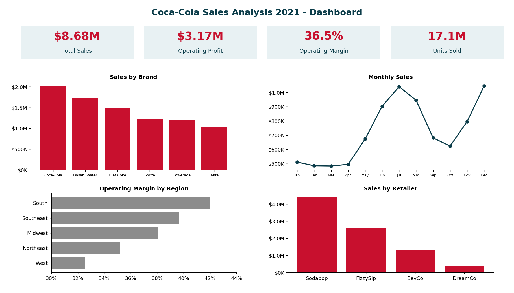
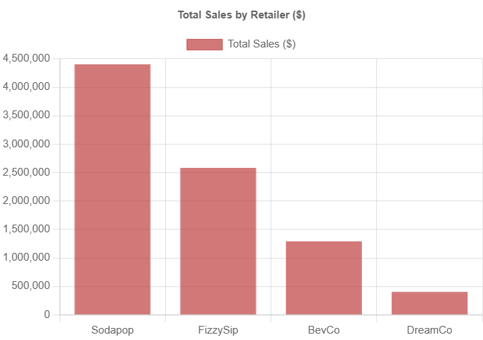
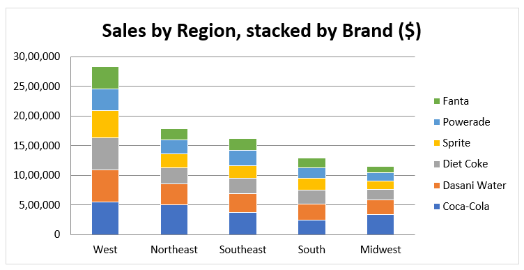
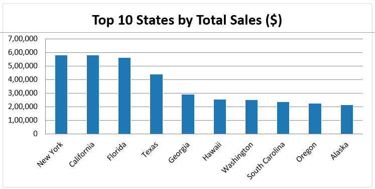
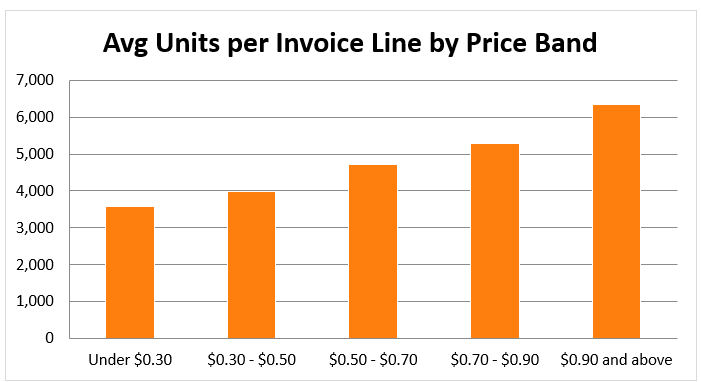
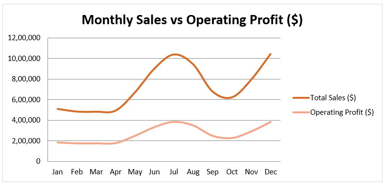
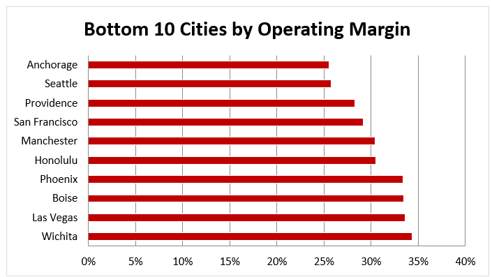
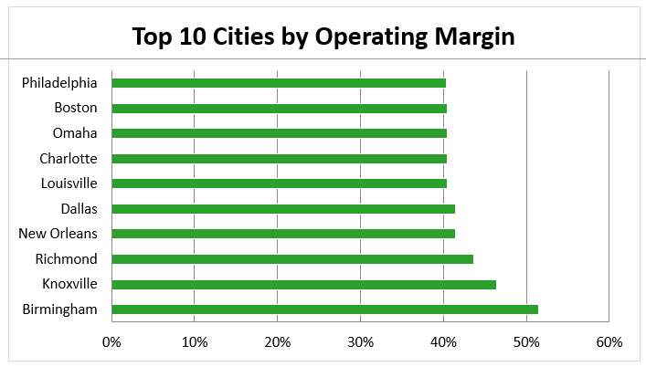
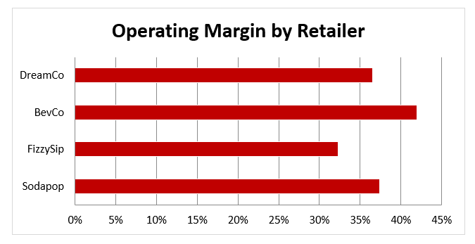

# Coke_Sales_Analysis
This project focuses on analyzing Coca-Cola sales data across key American retailers using Excel. The objective is to extract actionable insights from transactional and operational metrics like total sales, units sold, and operating margin. The analysis dives into regional performance, retailer efficiency, and sales trends.

An end-to-end Excel analysis of Coca-Cola beverage sales across four American retailers: data validation, sales and profitability analysis, time-based trends, visualisation, and business recommendations.

## Summary

| | |
|---|---|
| **Scale** | $8.68M sales · $3.17M operating profit · 36.5% margin · 17.1M units |
| **Best brand** | Coca-Cola: 23% of sales, highest margin (39%) |
| **Seasonality** | Peak in December, low in March (~2.2x gap); Jun-Aug = 33% of annual sales |
| **Biggest gap** | West is the largest region (33% of sales) but has the lowest margin (32.6%) |
| **Key caution** | Price and volume rise together because of seasonality, not price elasticity |

---

## 1. Context and Objective

Shelf space, promotions and pricing are costly decisions in a competitive retail market. This analysis identifies which **brands, retailers, regions and months** drive profit, and where margin is being lost, to support decisions by sales and category teams.

It answers three questions:
1. How do sales vary by retailer, region and time?
2. How are price, volume and profitability related?
3. How do operating margins differ across markets and over the year?

## 2. Dataset

**Source:** `data/Coke-sales-analysis.xlsx` (sheet `Data`)

| Attribute | Detail |
|---|---|
| Granularity | One row per invoice line, 3,888 rows |
| Period | 2 Jan to 25 Dec 2021 (270 invoice dates) |
| Retailers | Sodapop, FizzySip, BevCo, DreamCo |
| Geography | 5 regions · 50 states · 52 cities |
| Brands | Coca-Cola, Diet Coke, Sprite, Fanta, Powerade, Dasani Water |
| Fields | Retailer, Retailer ID, Invoice Date, Region, State, City, Brand, Price per Unit, Units Sold, Total Sales, Operating Profit, Operating Margin, Month |

## 3. Method

**Data preparation**
- The title banner sits above the data, so the header is row 5. Source data was left unchanged.
- Named ranges (`d_Sales`, `d_Units`, `d_Brand`, `d_Region`, `d_Month`, ...) keep every formula readable.
- Automated checks on the `Data_Prep` sheet all pass: no blanks, no duplicates, Sales = Price × Units on every row, Profit = Sales × Margin, month matches date, margins within 0-100%.
- Two invoice lines have 0 units. They were kept because they add $0 to every total.

**Metric definitions**

| Metric | Formula | Note |
|---|---|---|
| Operating Margin | Profit ÷ Sales | Weighted, not an average of row margins |
| Realised Price | Sales ÷ Units | Actual price per unit sold |
| Profit per Unit | Profit ÷ Units | Cost-efficiency per unit |
| % Contribution | Item ÷ Total | Share of sales / profit |
| Seasonality Index | Month sales ÷ average month × 100 | 100 = average month |

**Techniques:** `SUMIFS`, `AVERAGEIFS`, `COUNTIFS`, `CORREL`, `RANK`, `INDEX/MATCH`, conditional-format heatmaps, bar/line/scatter charts. All results are live formulas.

## 4. Key Findings

### Brands
| Finding | Evidence |
|---|---|
| Coca-Cola carries the portfolio | $2.02M sales, $793K profit, 4.1M units, 39% margin |
| Dasani Water earns the most per unit | ~$0.22 profit/unit at the highest realised price ($0.58) |
| Diet Coke and Sprite earn the least | Diet Coke margin 33%; Sprite profit/unit ~$0.16 |

### Retailers and regions
| Finding | Evidence |
|---|---|
| Sodapop is the scale partner | 51% of sales at a 37% margin |
| BevCo is the most efficient | 42% margin (South only) |
| FizzySip is highest priced but least profitable | ~$0.63/unit realised price, 32% margin |
| West: big but low-margin | 33% of sales, 32.6% margin |
| South: small but high-margin | 15% of sales, 42% margin |
| Brand x region creates large gaps | Dasani: ~51% margin in South/Southeast vs ~27% in West |

### Time
| Finding | Evidence |
|---|---|
| Strong seasonality | Dec peak ($1.05M), Mar low ($0.48M); Jun-Aug = 33% of sales |
| Margin is stable | 35.8%-37.0% every month, so growth is driven by volume and price |
| Profit per unit rises in peak season | $0.14 (Jan) to $0.23 (Dec) |

### Price, volume and cities
| Finding | Evidence |
|---|---|
| Weak price-volume link per invoice | r = 0.25 |
| Strong monthly link is misleading | r = 0.85, but both price and volume peak in the same seasons |
| City margin spread is wide | Birmingham 51%, Knoxville 46% vs Anchorage and Seattle ~26% |

## 5. Visuals

### Sales by Retailer

### Sales by Region

### Top 10 States by Total Sales

### Units per Invoice

### Monthly Sales vs Operating Profit

### Bottom 10 Cities by Operating Margin

### Top 10 Cities by Operating Margin

### Operating Margin by Retailer

## 6. Recommendations

| # | Action | Why |
|---|---|---|
| 1 | Protect and invest in Coca-Cola (shelf space, promotion) | Leads on sales, profit and margin |
| 2 | Push Dasani in the South and Southeast; fix pricing or cost in the West | 51% vs 27% margin |
| 3 | Plan inventory and promotions ahead of June and November; run campaigns for Jan-Apr | Peak is ~2.2x the low month |
| 4 | Review trade terms and costs with FizzySip in the West | Highest price, lowest margin |
| 5 | Tailor the brand mix by region | Same brand earns very different margins by market |
| 6 | Investigate Anchorage and Seattle; benchmark Birmingham and Knoxville | ~26% vs 46-51% margin |
| 7 | Review costs for Diet Coke and Sprite | Lowest profit per unit |

## 7. Limitations

- **One year only:** no year-over-year growth can be measured.
- **Retailer and region overlap:** BevCo operates only in the South and FizzySip only in the West, so regional gaps partly reflect retailer effects.
- **No cost, promotion or weather data:** margins are taken as given. The break-even calculator uses a **placeholder $50,000 fixed cost** (editable yellow cell).
- **Correlation is not causation:** price-volume relationships reflect seasonality and mix.

**Next steps:** add multi-year, cost and promotion data; run controlled price tests; add PivotTables and slicers for interactive exploration.

## 8. Workbook sheets

| Sheet | Contents |
|---|---|
| Summary | KPIs, insights, recommended actions |
| Data_Prep | Structure, cleaning steps, quality checks |
| Brand_Analysis | Brand scorecard and charts |
| Retailer_Region | Retailer/region tables, heatmaps, stacked bar |
| Geography, Cities | State and city performance, top/bottom cities |
| Monthly_Trends | Monthly/quarterly trends, seasonality, brand x month heatmap, margin stability |
| Price_Volume | Price bands, correlations, break-even calculator |
| Data | Original data |

**Tools:** Microsoft Excel

Author: **[Rasika Yadav]**

